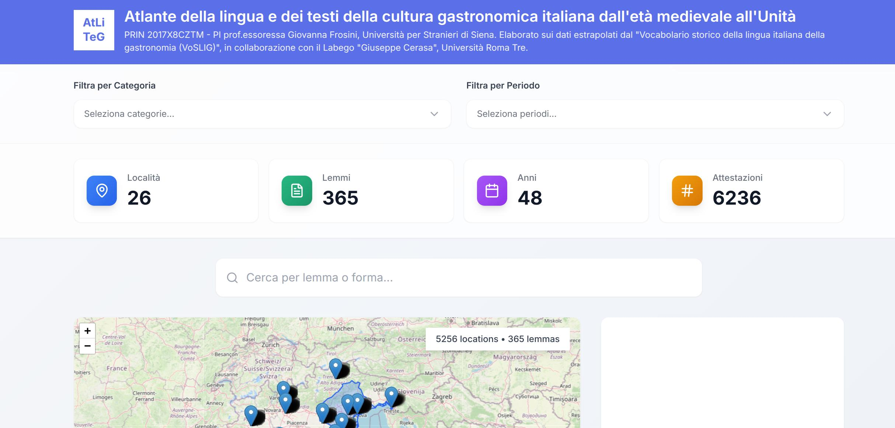
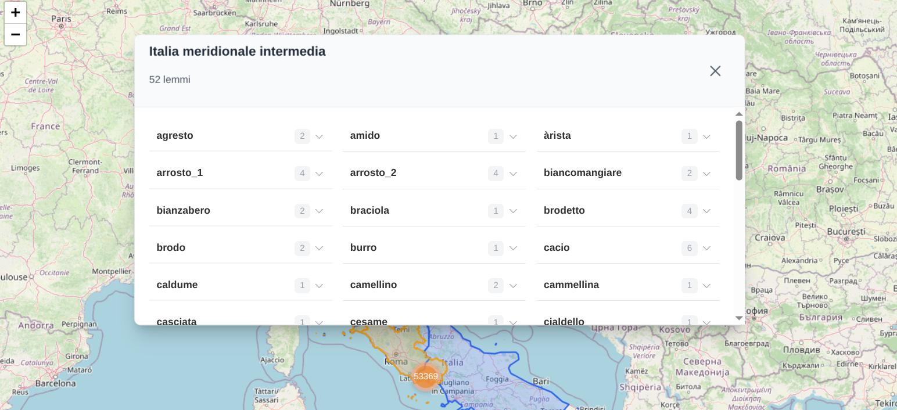
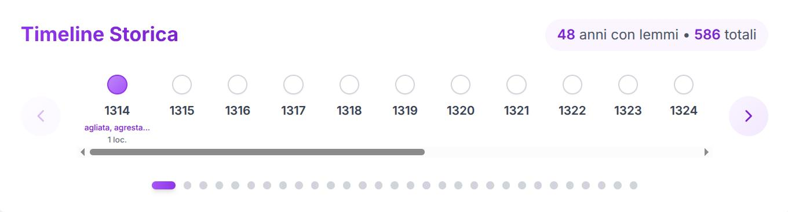
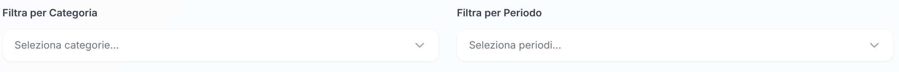
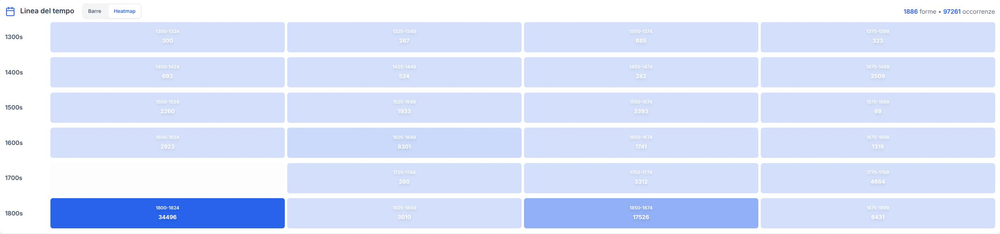

<p align="center">
	
</p>

# Dashboard Linguistico ATLITEG


<p align="center">
	
	<br/>
	<em>Screenshot della dashboard principale: esplorazione interattiva dei dati lessicografici e geografici.</em>
</p>

**Atliteg** (Atlante della lingua e dei testi della cultura gastronomica italiana dall'età medievale all'Unità) è un progetto di ricerca accademico che mappa e visualizza l'evoluzione storica e la distribuzione geografica della lingua e dei testi legati alla cultura gastronomica italiana (dal Medioevo all'Unità d'Italia).

## 📚 Scopo e Funzionalità

- **Esplorazione lessicografica**: Interfaccia visuale e interattiva per esplorare i dati del "Vocabolario storico della lingua italiana della gastronomia (VoSLIG)".
- **Mappe interattive**: Visualizzazione della diffusione geografica di termini gastronomici (piatti, ingredienti, tecniche di cottura) in diverse epoche.
- **Timeline e cronologia**: Tracciamento della comparsa e dell'evoluzione di parole e concetti nel tempo.
- **Analisi testuale**: Esplorazione di testi storici (ricettari, trattati di cucina) che costituiscono le fonti della cultura gastronomica italiana.
- **Treemap delle categorie**: Organizzazione gerarchica dei lemmi per categorie linguistiche.
- **Tabelle dettagliate**: Accesso ai dati specifici dei lemmi con filtri avanzati.

## 👥 Destinatari e Collaborazioni 

- Progetto sviluppato in collaborazione con il **Labgeo "Giuseppe Caraci"** (Università Roma Tre), laboratorio specializzato in geografia e cartografia.
- Finanziato dal **PRIN 2017** (Progetti di Ricerca di Interesse Nazionale), responsabile scientifico: prof.ssa Giovanna Frosini (Università per Stranieri di Siena).

## 📂 Dati e Fonti

- **CSV**: Lemmi, forme, coordinate e metadati (es. `Lemmi_forme_atliteg_updated.csv`)
- **GeoJSON**: Aree geografiche poligonali (es. `Ambiti geolinguistici newline.json`)


## ✨ Anteprima Visiva

<p align="center">
	
	
	<br/>
	<em>A sinistra: mappa interattiva con poligoni e marker. A destra: timeline per l'evoluzione dei termini nel tempo.</em>
</p>

<p align="center">
	
	
	<br/>
	<em>A sinistra: filtri globali per categoria e periodo. A destra: treemap delle categorie linguistiche.</em>
</p>

---

## 🗺️ Principali funzionalità utente

- Filtri globali per categoria e periodo, con badge visivi e reset rapido
- Mappa geografica con marker e poligoni, popup dettagliati, auto-zoom e contatori
- Indice alfabetico interattivo e ordinamento automatico
- Metriche dashboard: località, lemmi, anni, attestazioni

---


---

- **Frontend**: Next.js 16 (App Router), React 18.3, TypeScript, Tailwind CSS, React-Leaflet, PapaParse
- **Deployment**: Docker, Docker Compose, Nginx
- **Dati**: Tutti i dati sono statici e accessibili via `public/data/` (no backend API)


### Requisiti

- Node.js 20+ (per sviluppo)
- Docker & Docker Compose (per deployment)


---

```sh
cd lemmario-dashboard
npm install
npm run dev
# App su http://localhost:3000
```


---

```sh
npm run build
npm run start
# App su http://localhost:3000
```


---

```sh
docker-compose build
docker-compose up -d
# App su http://localhost:9000
```


---

Il progetto utilizza un **GitHub Actions Self-Hosted Runner** per il deploy automatico sul server di produzione (protetto da VPN).

**Vantaggi del self-hosted runner:**
- ✅ Funziona dietro VPN/firewall (niente problemi di connettività)
- ✅ Deploy più veloce (esecuzione locale)
- ✅ Configurazione semplificata (1 solo secret necessario!)
- ✅ Più sicuro (nessuna esposizione porte SSH)

**Trigger automatici:**
- Push o merge su branch `master`
- Esecuzione manuale tramite GitHub Actions

**Cosa fa il workflow:**
1. 📥 Git pull del codice aggiornato
2. 🏗️ Build delle immagini Docker
3. 🔄 Restart dei container
4. 🧹 Pulizia risorse Docker non utilizzate
5. 🔍 Verifica deployment

**Setup:**
- 🚀 [docs/DEPLOY_QUICKSTART.md](docs/DEPLOY_QUICKSTART.md) - Guida rapida
- 📖 [docs/GITHUB_ACTIONS_SETUP.md](docs/GITHUB_ACTIONS_SETUP.md) - Setup completo
- ⚙️ [install-github-runner.sh](install-github-runner.sh) - Script installazione runner
- 📄 [.github/workflows/deploy-production.yml](.github/workflows/deploy-production.yml) - Workflow


---

1. Aggiungi/aggiorna file in `data/`
2. Copia in `lemmario-dashboard/public/data/`

---


## 📸 Aggiornamento e gestione immagini

- Le immagini e gli screenshot vanno posizionati nella cartella `docs/` (es. `docs/screenshot-dashboard.png`).
- Per aggiornare le immagini, sostituisci i file nella cartella `docs/` mantenendo lo stesso nome, oppure aggiorna i riferimenti nel README.
- Per generare nuovi screenshot:
	1. Avvia l'app localmente (`npm run dev`)
	2. Cattura le schermate delle funzionalità principali
	3. Salva le immagini in `docs/` e aggiorna i riferimenti se necessario

---


```text
atliteg-map/
├── data/                # Dati sorgente (CSV, JSON)
├── docs/                # Documentazione tecnica e scientifica
├── lemmario-dashboard/  # Web app Next.js/React
│   ├── app/             # Pagine/layout Next.js
│   ├── components/      # Componenti React UI
│   ├── services/        # Data loader/parsing
│   ├── types/           # Tipi TypeScript
│   ├── public/data/     # Dati statici per frontend
│   └── ...
├── process_data.py      # Script Python per preprocessing dati
└── ...
```


Per dettagli su architettura e dataset, vedi `docs/ARCHITECTURE.md` e `docs/DATASET_SPECIFICATION.md`.

---

---

## 🔧 Personalizzazione

- Configurazione avanzata: vedi [Vite](https://vite.dev/config/) e `tailwind.config.js`.
- Per modifiche dati, aggiorna i file in `data/` e `public/data/`.

---

## 📝 Licenza

Vedi il file LICENSE nella root del progetto.

