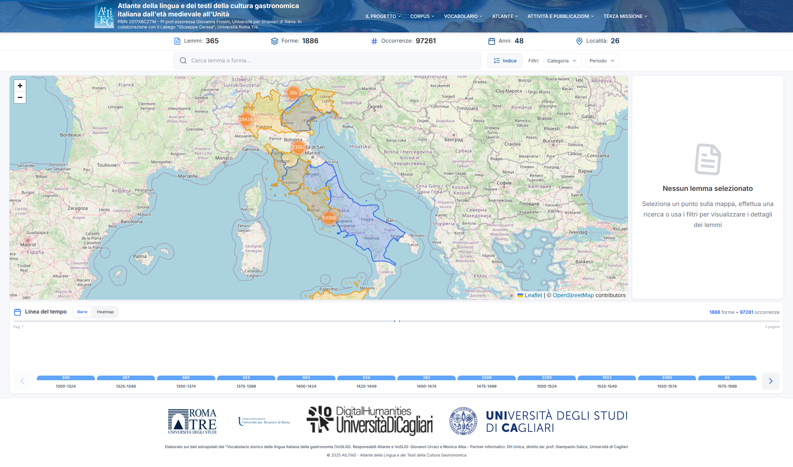
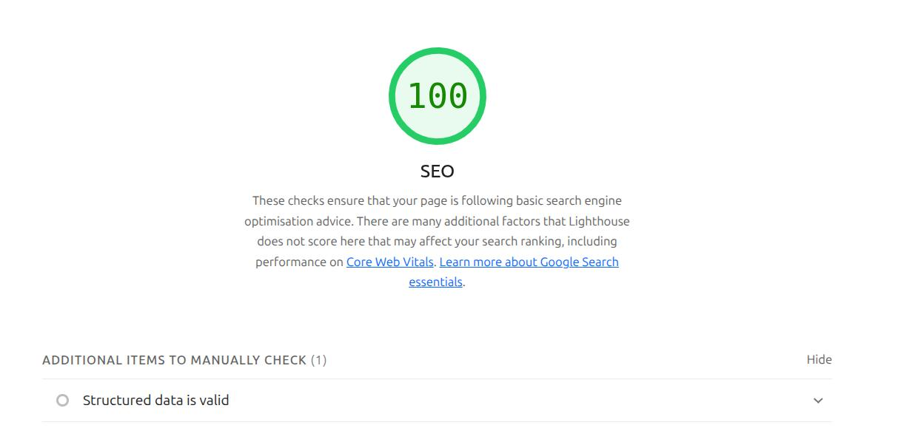

<p align="center">
	
</p>

# **Menu**

**[Scopo e Funzionalità](#scopo-e-funzionalità) | [Destinatari e Collaborazioni](#destinatari-e-collaborazioni) | [Anteprima Visiva](#anteprima-visiva) | [Principali funzionalità utente](#principali-funzionalità-utente) | [Frontend, Deployment, Dati](#frontend-deployment-dati) | [Requisiti](#requisiti) | [Procedura Corretta per Aggiornare i Dati Geografici](#procedura-corretta-per-aggiornare-i-dati-geografici) | [Documentazione](#documentazione) | [Dati e Fonti](#dati-e-fonti) | [Personalizzazione](#personalizzazione) | [Ottimizzazione SEO](#ottimizzazione-seo) | [Licenza](#licenza)**

# Dashboard Linguistico ATLITEG


<p align="center">
	
	<br/>
	<em>Screenshot della dashboard principale: esplorazione interattiva dei dati lessicografici e geografici.</em>
</p>

**Atliteg** (Atlante della lingua e dei testi della cultura gastronomica italiana dall'età medievale all'Unità) è un progetto di ricerca accademico che mappa e visualizza l'evoluzione storica e la distribuzione geografica della lingua e dei testi legati alla cultura gastronomica italiana (dal Medioevo all'Unità d'Italia).

## 📚 Scopo e Funzionalità

- **Esplorazione lessicografica**: Interfaccia visuale e interattiva per esplorare i dati del "Vocabolario storico della lingua italiana della gastronomia (VoSLIG)".
- **Mappe interattive**: Visualizzazione della diffusione geografica di termini gastronomici (piatti, ingredienti, tecniche di cottura) in diverse epoche.
- **Timeline storica avanzata**: Visualizzazione cronologica con istogrammi aggregati per quarti di secolo (periodi di 25 anni), mostrando la distribuzione temporale delle occorrenze con somma totale indipendente dalla località geografica.
- **Analisi testuale**: Esplorazione di testi storici (ricettari, trattati di cucina) che costituiscono le fonti della cultura gastronomica italiana.
- **Treemap delle categorie**: Organizzazione gerarchica dei lemmi per categorie linguistiche.
- **Tabelle dettagliate**: Accesso ai dati specifici dei lemmi con filtri avanzati.

## 👥 Destinatari e Collaborazioni 

- Progetto sviluppato in collaborazione con il **Labgeo "Giuseppe Caraci"** (Università Roma Tre), laboratorio specializzato in geografia e cartografia.
- Finanziato dal **PRIN 2017** (Progetti di Ricerca di Interesse Nazionale), responsabile scientifico: prof.ssa Giovanna Frosini (Università per Stranieri di Siena).

## ✨ Anteprima Visiva

<p align="center">
	
	
	<br/>
	<em>A sinistra: mappa interattiva con poligoni e marker. A destra: timeline per l'evoluzione dei termini nel tempo.</em>
</p>

<p align="center">
	
	
	<br/>
	<em>A sinistra: filtri globali per categoria e periodo. A destra: treemap delle categorie linguistiche.</em>
</p>

---

## 🗺️ Principali funzionalità utente

- Filtri globali per categoria e periodo, con badge visivi e reset rapido
- Mappa geografica con clustering intelligente:
  - **Cerchi circolari sempre visibili**: Tutti i marker sono visualizzati come cerchi (mai pin individuali)
  - **Aggregazione dinamica**: I cerchi si uniscono automaticamente in base allo zoom
  - **Indicatori di frequenza**: Colori differenziati (blu/arancione/rosso) in base alle occorrenze
  - **Popup dettagliati**: Click sui cerchi per vedere lemmi, forme e metadati
  - **Auto-zoom e contatori**: Navigazione fluida con metriche in tempo reale
- Indice alfabetico interattivo e ordinamento automatico
- Metriche dashboard: località, lemmi, anni, attestazioni

---


---

- **Frontend**: Next.js 16 (App Router), React 18.3, TypeScript, Tailwind CSS, React-Leaflet, PapaParse
- **Deployment**: Docker, Docker Compose, Nginx
- **Dati**: Tutti i dati sono statici e accessibili via `public/data/` (no backend API)


### Requisiti

- Node.js 20+ (per sviluppo)
- Docker & Docker Compose (per deployment)


---

```sh
cd lemmario-dashboard
npm install
npm run dev
# App su http://localhost:3000
```


---

```sh
npm run build
npm run start
# App su http://localhost:3000
```


---

```sh
docker-compose build
docker-compose up -d
# App su http://localhost:9000
```


---

Il progetto utilizza un **GitHub Actions Self-Hosted Runner** per il deploy automatico sul server di produzione (protetto da VPN).

**Trigger automatici:**
- Push o merge su branch `master`
- Esecuzione manuale tramite GitHub Actions

**Cosa fa il workflow:**
1. 📥 Git pull del codice aggiornato
2. 🏗️ Build delle immagini Docker
3. 🔄 Restart dei container
4. 🧹 Pulizia risorse Docker non utilizzate
5. 🔍 Verifica deployment

**Setup:**
- 🚀 [docs/guides/deploy-quickstart.md](docs/guides/deploy-quickstart.md) - Guida rapida
- 📖 [docs/guides/github-actions.md](docs/guides/github-actions.md) - Setup completo
- ⚙️ [install-github-runner.sh](install-github-runner.sh) - Script installazione runner
- 📄 [.github/workflows/deploy-production.yml](.github/workflows/deploy-production.yml) - Workflow

```text
atliteg-map/
├── data/                # Dati geografici sorgente (JSON)
├── docs/                # Documentazione tecnica e scientifica
├── lemmario-dashboard/  # Web app Next.js/React
│   ├── app/             # Pagine/layout Next.js
│   ├── components/      # Componenti React UI
│   ├── services/        # Data loader/parsing
│   ├── types/           # Tipi TypeScript
│   ├── public/data/     # Dati statici per frontend
│   └── ...
├── process_data.py      # Script Python per preprocessing dati
└── ...
```


Per dettagli su architettura e dataset, vedi [docs/architecture/system-architecture.md](docs/architecture/system-architecture.md) e [docs/architecture/dataset-specification.md](docs/architecture/dataset-specification.md).

---

## 📂 Dati e Fonti

- **CSV**: Lemmi, forme, coordinate e metadati (es. `Lemmi_forme_atliteg_updated.csv`)
- **GeoJSON**: Aree geografiche poligonali (es. `Ambiti geolinguistici newline.json`)

---

## ✅ Procedura Corretta per Aggiornare i Dati Geografici

**Rigenera i file JSON:**

```bash
cd lemmario-dashboard
node scripts/preprocess-data.js
# Verifica che venga stampato: "✅ CSV processato: XXXX record"
```

### 🎯 Esempio Pratico: Aggiungere una Nuova Regione

Se aggiungi lemmi di una nuova regione (es. Friuli-Venezia Giulia):

1. Nel CSV, assicurati che i lemmi abbiano:
   - `Coll.Geografica`: "Nome Regione"
   - `Latitudine`: `#N/A`
   - `Longitudine`: `#N/A`
   - `Tipo coll.Geografica`: `Regione`
   - `reg_istat_code`: Codice ISTAT della regione (es. "06" per Friuli)

2. Segui la procedura sopra per rigenerare e copiare i file

3. La regione apparirà colorata in giallo sulla mappa

---


## 📚 Documentazione

La documentazione completa è disponibile nella cartella [`docs/`](docs/README.md) ed è organizzata per argomento.

### 📖 Indice Completo Documentazione

**[→ Indice Generale (docs/README.md)](docs/README.md)** - Navigazione completa di tutta la documentazione

#### 🏗️ Architecture - Design e Specifiche Tecniche
- [System Architecture](docs/architecture/system-architecture.md) - Panoramica architettura sistema
- [Backend API Design](docs/architecture/backend-api-design.md) - Design e implementazione API backend
- [Dataset Specification](docs/architecture/dataset-specification.md) - Specifiche dati e formati
- [Requirements](docs/architecture/requirements.md) - Requisiti funzionali (30 requisiti)
- [Performance](docs/architecture/performance.md) - Analisi e ottimizzazione performance
- [Motion System](docs/architecture/motion-system.md) - Sistema animazioni e transizioni
- [Dynamic Graphics](docs/architecture/dynamic-graphics.md) - Grafica dinamica e visualizzazioni

#### 📘 Guides - Manuali e Guide Operative

**Guide Principali:**
- [Quick Start](docs/guides/quick-start.md) - Guida rapida per iniziare
- [User Guide](docs/guides/user-guide.md) - Manuale utente completo
- [Deployment Guide](docs/guides/deployment-guide.md) - Guida deployment in produzione
- [Testing Guide](docs/guides/testing.md) - Guida esecuzione test
- [Test Checklist](docs/guides/test-checklist.md) - Checklist testing manuale (189 test)

**Guide Tecniche:**
- [GitHub Actions](docs/guides/github-actions.md) - Configurazione CI/CD
- [SEO Implementation](docs/guides/seo-implementation.md) - Strategia SEO/AEO/GEO
- [API Reference](docs/guides/api-reference.md) - Riferimento API
- [Quick Commands](docs/guides/quick-commands.md) - Comandi frequenti
- [Region Codes](docs/guides/region-codes.md) - Codici regionali ISTAT

**Guide Dati:**
- [CSV Upload Guide](docs/guides/CSV_UPLOAD_GUIDE.md) - Guida caricamento CSV
- [Data Sync](docs/guides/data-sync.md) - Procedure sincronizzazione dati
- [Upload Refresh](docs/guides/upload-refresh-guide.md) - Procedura refresh dati
- [Upload Troubleshooting](docs/guides/upload-troubleshooting.md) - Risoluzione problemi
- [Regions Feature](docs/guides/regions-feature.md) - Integrazione codici regionali ISTAT

#### 🧩 Components - Componenti Sistema

**Componenti Principali:**
- [Lemmario Dashboard](docs/components/lemmario-dashboard.md) - Documentazione tecnica frontend Next.js
- [Dashboard Features](docs/components/dashboard-features.md) - Funzionalità e componenti dashboard
- [Map Clustering](docs/components/map-clustering-behavior.md) - Clustering mappa geografica
- [Timeline Component](docs/components/timeline-component.md) - Timeline storica
- [Popup System](docs/components/popup-system.md) - Sistema popup con accordion

**Componenti UI:**
- [Header](docs/components/header.md) - Header navigazione e branding
- [Filters](docs/components/filters.md) - Filtri categoria/periodo multi-select
- [Search Bar](docs/components/search-bar.md) - Ricerca autocompletante
- [Alphabetical Index](docs/components/alphabetical-index.md) - Indice alfabetico A-Z
- [Lemma Detail](docs/components/lemma-detail.md) - Pannello dettaglio forme
- [Metrics Summary](docs/components/metrics-summary.md) - Metriche aggregate

#### ⚙️ Project - Meta-documentazione

- [Roadmap](docs/project/ROADMAP.md) - Piano sviluppo futuro (37 items, 6 release)
- [Changelog](docs/project/CHANGELOG.md) - Registro modifiche
- [Contributing](docs/project/CONTRIBUTING.md) - Linee guida contribuzione
- [Bugs and Features](docs/project/bugs-and-features.md) - Tracking bug e funzionalità

#### 🔒 Security - Sicurezza e Protezione Dati

- [Data Security](docs/security/DATA_SECURITY.md) - Setup protezione dati e file sensibili
- [Security Config](docs/security/SECURITY_CONFIG.md) - Configurazione security (Nginx, JWT, API keys)
- [Security Executive Summary](docs/security/SECURITY_EXEC_SUMMARY.md) - Sommario esecutivo

#### 🔍 Navigazione Rapida per Ruolo

**Per Utenti Finali:**
- [Quick Start](docs/guides/quick-start.md) → [User Guide](docs/guides/user-guide.md)

**Per Sviluppatori:**
- [System Architecture](docs/architecture/system-architecture.md) → [Components](docs/components/lemmario-dashboard.md) → [Quick Commands](docs/guides/quick-commands.md)

**Per DevOps:**
- [Deployment Guide](docs/guides/deployment-guide.md) → [GitHub Actions](docs/guides/github-actions.md) → [Security Config](docs/security/SECURITY_CONFIG.md)

---

## 🔧 Personalizzazione

- Configurazione avanzata: vedi [Vite](https://vite.dev/config/) e `tailwind.config.js`.
- Per modifiche dati, aggiorna i file in `data/` e `public/data/`.

---

## 🔍 Ottimizzazione SEO

<p align="center">
	
	<br/>
	<em>Punteggio SEO 100/100</em>
</p>

Il progetto implementa le seguenti ottimizzazioni SEO per migliorare la visibilità sui motori di ricerca:

### Metadata e Tag Essenziali

- **Title e Description**: Tag ottimizzati con parole chiave rilevanti
- **Open Graph**: Tag per condivisione ottimale su social media (Facebook, LinkedIn)
- **Twitter Cards**: Metadata specifici per Twitter
- **Favicon e Apple Icons**: Icone per tutti i dispositivi e piattaforme
- **Canonical URL**: Prevenzione contenuti duplicati

### Contenuto Strutturato

- **Schema.org JSON-LD**: Markup strutturato per motori di ricerca (tipo: WebSite, SearchAction, Organization)
- **Sitemap XML**: Generazione automatica per indicizzazione completa
- **Robots.txt**: Configurazione crawling ottimale

### Performance e Accessibilità

- **Viewport Meta**: Ottimizzazione per dispositivi mobili
- **Theme Color**: Integrazione con browser mobile
- **Alt Text**: Descrizioni per tutte le immagini (inclusi loghi partner)

### Partner Istituzionali

Il footer include i loghi dei partner con markup semantico appropriato:

- Università Roma Tre
- Università per Stranieri di Siena
- DH Unica (Digital Humanities, Università di Cagliari)
- AtLiTeG Project

**Punteggio SEO**: 100/100

---

## 📝 Licenza

Vedi il file LICENSE nella root del progetto.

