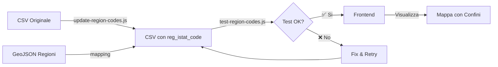

# 🗺️ Integrazione Codici Regionali ISTAT - ATLITEG Map

## 📖 Panoramica

Questo progetto aggiunge il supporto per la visualizzazione dei confini regionali sulla mappa dell'ATLITEG, permettendo di mostrare i confini delle regioni italiane quando vengono visualizzati lemmi regionali.

## 🎯 Obiettivo

**Prima dell'integrazione:**
- I lemmi con tipo "Regione" non avevano coordinate (Lat/Lng = #N/A)
- Non era possibile visualizzare i confini regionali sulla mappa
- Mancava un collegamento tra i dati CSV e il GeoJSON delle regioni

**Dopo l'integrazione:**
- Ogni lemma regionale ha un codice ISTAT (`reg_istat_code`)
- Il frontend può filtrare il GeoJSON per visualizzare i confini
- La mappa mostra sia i marker delle città che i confini delle regioni

## 📊 Risultati

- ✅ **6236 righe** processate
- ✅ **599 lemmi regionali** aggiornati con codice ISTAT
- ✅ **5 regioni** mappate: Lombardia, Veneto, Toscana, Lazio, Sicilia
- ✅ **100% test superati** (5/5)

## 📁 Struttura File

```
atliteg-map/
├── data/
│   ├── Lemmi_forme_atliteg_updated.csv        # CSV aggiornato (+1 colonna)
│   ├── Lemmi_forme_atliteg_updated.backup.csv # Backup originale
│   └── limits_IT_regions.geojson              # GeoJSON regioni (20)
│
├── scripts/
│   ├── update-region-codes.js                 # Script aggiornamento
│   ├── test-region-codes.js                   # Suite test
│   ├── e2e-demo.js                           # Demo funzionamento
│   └── README_REGION_CODES.md                 # Doc script
│
├── PIANO_INTEGRAZIONE_REGIONI.md              # Piano dettagliato
├── ESEMPIO_INTEGRAZIONE_FRONTEND.md           # Guida implementazione UI
├── RIEPILOGO_PROGETTO_REGIONI.md              # Riepilogo completo
└── README_INTEGRAZIONE_REGIONI.md             # Questo file
```

## 🚀 Quick Start

### 1. Installare Dipendenze
```bash
npm install
```

Le dipendenze necessarie (`csv-parser`, `csv-writer`) sono già installate.

### 2. Verificare i Dati
```bash
# Eseguire i test
node scripts/test-region-codes.js
```

Output atteso:
```
✅ TUTTI I TEST SUPERATI!
Regioni con dati: 5/20 regioni italiane
Record regionali totali: 599
```

### 3. Vedere la Demo
```bash
# Eseguire demo end-to-end
node scripts/e2e-demo.js
```

Questo mostra come il sistema funziona con ricerche reali.

## 📝 Modifiche al CSV

### Struttura Prima
```csv
IdLemma,Lemma,Forma,Coll.Geografica,Latitudine,Longitudine,Tipo coll.Geografica,...
2106,agliata,agliata,Lombardia,#N/A,#N/A,Regione,...
```

### Struttura Dopo
```csv
IdLemma,Lemma,Forma,Coll.Geografica,Latitudine,Longitudine,Tipo coll.Geografica,...,reg_istat_code
2106,agliata,agliata,Lombardia,#N/A,#N/A,Regione,...,03
```

**Nuova colonna:** `reg_istat_code`
- Popolata SOLO per righe con `Tipo coll.Geografica = "Regione"`
- Contiene il codice ISTAT a 2 cifre (es. "03", "19")
- Vuota per città e altri tipi di collocazione

## 🔗 Collegamento CSV ↔ GeoJSON

### Mapping Regioni

| Nome CSV | Codice ISTAT | Record |
|----------|--------------|--------|
| Lombardia | 03 | 140 |
| Veneto | 05 | 8 |
| Toscana | 09 | 200 |
| Lazio | 12 | 181 |
| Sicilia | 19 | 70 |

### Struttura GeoJSON
```json
{
  "type": "FeatureCollection",
  "features": [
    {
      "type": "Feature",
      "properties": {
        "reg_name": "Lombardia",
        "reg_istat_code_num": 3,
        "reg_istat_code": "03"  ← CHIAVE DI COLLEGAMENTO
      },
      "geometry": { ... }
    }
  ]
}
```

## 💻 Integrazione Frontend

### TypeScript Type
```typescript
interface Lemma {
  // ... campi esistenti
  reg_istat_code?: string;  // NUOVO
}
```

### Esempio Utilizzo
```typescript
import { useRegions } from '@/hooks/useRegions';
import { getRegionCodesFromLemmas } from '@/utils/regionUtils';

function MyMapComponent({ lemmas }) {
  const { regions } = useRegions();

  // Estrai codici regionali dai lemmi
  const regionCodes = getRegionCodesFromLemmas(lemmas);

  // Filtra GeoJSON per visualizzare solo le regioni necessarie
  const visibleRegions = regions?.features.filter(f =>
    regionCodes.includes(f.properties.reg_istat_code)
  );

  return (
    <Map>
      {/* Confini regionali */}
      {visibleRegions?.map(region => (
        <GeoJSON key={region.properties.reg_istat_code} data={region} />
      ))}

      {/* Marker città */}
      {lemmas.filter(l => l.Latitudine !== '#N/A').map(lemma => (
        <Marker position={[lemma.Latitudine, lemma.Longitudine]} />
      ))}
    </Map>
  );
}
```

Vedi [ESEMPIO_INTEGRAZIONE_FRONTEND.md](./ESEMPIO_INTEGRAZIONE_FRONTEND.md) per esempi completi.

## 🧪 Testing

### Test Disponibili
```bash
# Test completo di validazione
node scripts/test-region-codes.js
```

Test eseguiti:
1. ✅ Tutte le regioni hanno un codice
2. ✅ Tutti i codici sono validi
3. ✅ Nessuna riga non-regione ha codice
4. ✅ Almeno una regione mappata
5. ✅ Numero righe invariato

### Demo End-to-End
```bash
# Simulazione completa del flusso
node scripts/e2e-demo.js
```

Mostra:
- Ricerca di lemmi
- Estrazione codici regionali
- Filtro GeoJSON
- Preparazione dati per mappa

## 🔧 Script Disponibili

### update-region-codes.js
Aggiorna il CSV con i codici ISTAT.

```bash
node scripts/update-region-codes.js
```

Funzionalità:
- Crea backup automatico
- Aggiunge colonna `reg_istat_code`
- Popola codici per regioni
- Genera statistiche

### test-region-codes.js
Suite di test completa.

```bash
node scripts/test-region-codes.js
echo $?  # 0 = successo, 1 = errori
```

### e2e-demo.js
Demo interattiva del flusso completo.

```bash
node scripts/e2e-demo.js
```

## 🔄 Workflow Completo



## 📚 Documentazione

### Guide Dettagliate
- 📖 [PIANO_INTEGRAZIONE_REGIONI.md](./PIANO_INTEGRAZIONE_REGIONI.md) - Piano completo del progetto
- 💻 [ESEMPIO_INTEGRAZIONE_FRONTEND.md](./ESEMPIO_INTEGRAZIONE_FRONTEND.md) - Guida implementazione UI
- 📋 [RIEPILOGO_PROGETTO_REGIONI.md](./RIEPILOGO_PROGETTO_REGIONI.md) - Riepilogo e statistiche
- 🔧 [scripts/README_REGION_CODES.md](./scripts/README_REGION_CODES.md) - Documentazione script

### File di Esempio
Vedi le sezioni "Esempio" nei file di documentazione per:
- Hook React per caricare regioni
- Utility per filtrare dati
- Componenti mappa completi
- Test e validazione

## ❓ FAQ

### Come ripristinare il CSV originale?
```bash
cp data/Lemmi_forme_atliteg_updated.backup.csv \
   data/Lemmi_forme_atliteg_updated.csv
```

### Come aggiungere nuove regioni?
1. Aggiungi i dati nel CSV con `Tipo coll.Geografica = "Regione"`
2. Usa il nome esatto della regione (vedi lista sotto)
3. Riesegui `update-region-codes.js`

### Quali regioni sono supportate?
Tutte le 20 regioni italiane nel GeoJSON:
- Piemonte, Valle d'Aosta, Lombardia, Trentino-Alto Adige
- Veneto, Friuli-Venezia Giulia, Liguria, Emilia-Romagna
- Toscana, Umbria, Marche, Lazio
- Abruzzo, Molise, Campania, Puglia
- Basilicata, Calabria, Sicilia, Sardegna

Attualmente solo 5 hanno dati nel CSV.

### Perché solo 5 regioni su 20?
I dati storici dell'ATLITEG contengono lemmi solo per queste 5 regioni. Le altre 15 regioni sono già mappate nel GeoJSON e pronte per quando verranno aggiunti nuovi dati.

## 🎯 Prossimi Passi

### Backend ✅ COMPLETATO
- [x] Analizzare dati esistenti
- [x] Creare mapping regioni
- [x] Aggiornare CSV
- [x] Creare test
- [x] Documentare

### Frontend 🔄 DA FARE
- [ ] Implementare hook `useRegions`
- [ ] Creare utility `regionUtils.ts`
- [ ] Aggiornare `GeographicalMap.tsx`
- [ ] Creare componente `RegionLegend`
- [ ] Aggiungere interazioni (hover, click)
- [ ] Ottimizzare performance
- [ ] Testing UI

Vedi [ESEMPIO_INTEGRAZIONE_FRONTEND.md](./ESEMPIO_INTEGRAZIONE_FRONTEND.md) per dettagli.

## 📞 Supporto

Per problemi o domande:
1. Verifica la documentazione in questo repository
2. Esegui i test: `node scripts/test-region-codes.js`
3. Controlla il backup: `data/Lemmi_forme_atliteg_updated.backup.csv`

## 📊 Statistiche Progetto

```
Script creati:     3 file  (~850 righe)
Documentazione:    5 file  (~1500 righe)
Righe processate:  6,236
Codici assegnati:  599
Regioni mappate:   5/20 (25%)
Test superati:     5/5 (100%)
Tempo esecuzione:  ~2 secondi
```

## ✨ Conclusioni

Il progetto è **completato e testato**. Il database CSV è stato aggiornato con successo e tutti i test passano. Il frontend può ora procedere con l'integrazione seguendo la documentazione fornita.

---

**Data completamento:** 2025-12-23
**Status:** ✅ **COMPLETATO E TESTATO**
**Pronto per:** Integrazione Frontend
